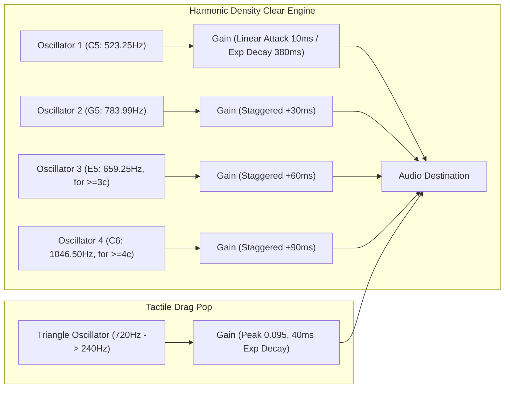

# Rect10 Technical Architecture Specification

This document provides a deep architectural and algorithmic analysis of **Rect10**, detailing the data structures, computational complexity, rendering pipeline, acoustic synthesis, and mobile input mechanics.

---

## 1. Architectural Philosophy

1. **Zero-Dependency Runtime:** The entire client runs natively in modern browsers with zero external runtime libraries, bundlers, or frameworks.
2. **Zero-Allocation Hot Paths:** Memory allocations during active dragging, timer ticks, and frame rendering are strictly eliminated to prevent V8 Scavenge / Minor GC pauses (which cause 5–15ms frame drops on mobile WebViews).
3. **Decoupled Architecture:** Clean separation of concerns between Mathematical Logic (`engine.js`), Presentation (`view.js`), Procedural Audio (`audio.js`), and Application Loop (`game.js`).
4. **Headless Testability:** The mathematical engine and game logic run identically in headless Node.js environments and browser contexts, enabling sub-millisecond automated unit testing.

---

## 2. Subsystem Topology & Data Flow

```mermaid
flowchart TD
    subgraph ViewLayer ["Presentation & Input Layer (view.js, style.css)"]
        PointerInput["Pointer / Mouse / Touch Handler (Clamped Coordinates)"]
        CanvasRenderer["High-DPI Canvas 2D Engine (120Hz VSync)"]
        HUDView["HUD Overlay (Timer, Score, Moves, Progress Bar)"]
        AudioSynth["Web Audio Procedural Synthesizer (audio.js)"]
    end

    subgraph Controller ["Application Controller (game.js)"]
        Loop["requestAnimationFrame Loop (delta timing)"]
        DragState["Reusable Drag State Struct {r1, c1, r2, c2}"]
        Lifecycle["Game Lifecycle (100s Timer, Pause Curtain, High Scores)"]
    end

    subgraph CoreEngine ["Mathematical Engine (engine.js)"]
        GridBuffer["Uint8Array(165) Grid Buffer (11x15)"]
        PrefixMatrix["Int16Array(192) 2D Prefix Sum Matrix"]
        MoveFinder["Monotonic Deadlock & Valid Move Detector"]
        WeightedRNG["Low-Bias Cumulative Distribution Sampler"]
    end

    PointerInput -->|Normalized Coordinates| DragState
    DragState -->|Commit on pointerup| CoreEngine
    CoreEngine -->|O(1) Range Queries| PrefixMatrix
    CoreEngine -->|Move Count & State| Lifecycle
    Loop -->|Render Frame (<0.3ms)| CanvasRenderer
    Lifecycle -->|Timer & Score updates| HUDView
    CoreEngine -->|Clear Events & Size| AudioSynth
    DragState -->|Cell Boundary Crossings| AudioSynth
```

---

## 3. Mathematical Engine & Data Structures

### A. Memory Layout
The board and its spatial index are represented as continuous flat typed arrays:
* **Grid Buffer:** `Uint8Array(165)` ($11 \text{ columns} \times 15 \text{ rows}$).
  * Values: $0$ (cleared / empty space), $1\dots 9$ (active numbers).
  * Flat indexing: $\text{index} = r \times 11 + c$.
* **2D Summed-Area Table (Prefix Sums):** `Int16Array(192)`.
  * Dimensions: $(15 + 1) \times (11 + 1) = 16 \times 12 = 192$ elements.
  * Stride: $S = 11 + 1 = 12$.
  * Flat indexing: $P[r][c] = \text{index } r \times 12 + c$.

### B. $O(1)$ Range Sum Queries (Summed-Area Table)
The prefix matrix stores the cumulative sum of all cells in the rectangular subgrid from $(0, 0)$ to $(r-1, c-1)$:
$$P[r+1][c+1] = \sum_{i=0}^r \sum_{j=0}^c G[i][j]$$

Built in $O(R \times C) = 165$ operations ($\approx 1.5\,\mu\text{s}$) via dynamic programming:
$$P[r+1][c+1] = G[r][c] + P[r+1][c] + P[r][c+1] - P[r][c]$$

Given any arbitrary bounding box from corner $(r_1, c_1)$ to $(r_2, c_2)$ with $r_{\min} \le r_{\max}, c_{\min} \le c_{\max}$:
$$\text{Sum} = P[r_{\max}+1][c_{\max}+1] - P[r_{\min}][c_{\max}+1] - P[r_{\max}+1][c_{\min}] + P[r_{\min}][c_{\min}]$$

* **Query Cost:** Exactly 4 flat array reads, 2 subtractions, 1 addition.
* **Measured Latency:** **$5.6\text{ nanoseconds}$** per query.

### C. Monotonic Move Finder & Deadlock Detection
Without optimization, searching all possible rectangles on an $11 \times 15$ grid requires evaluating:
$$\binom{15+1}{2} \times \binom{11+1}{2} = \binom{16}{2} \times \binom{12}{2} = 120 \times 66 = 7,920 \text{ rectangles}$$

**Monotonic Pruning Optimization:**
Because all cell values are non-negative ($v \ge 0$), expanding a rectangle along any dimension is monotonically non-decreasing ($\Delta \text{Sum} \ge 0$):
1. For each top-left anchor $(r_1, c_1)$, expand height $r_2 \ge r_1$.
2. Check single-column strip: $\text{Sum}(r_1, c_1, r_2, c_1)$. If this exceeds $10$, **break height expansion immediately** (all rectangles of this or greater height containing this column will exceed $10$).
3. Expand width $c_2 \ge c_1$. If $\text{Sum}(r_1, c_1, r_2, c_2) > 10$, **break width expansion immediately**.

* **Pruned Search Space:** Drops from $7,920$ down to **fewer than 450 evaluated rectangles**.
* **Measured Full-Board Scan Latency:** **$0.003\text{ ms}$** ($3\,\mu\text{s}$).
* **Execution Strategy:** Runs strictly once per valid clear (never during drag movements), guaranteeing zero impact on frame rendering.

### D. Zero-Value Tunneling Matrix
When cells are cleared, they are set to $0$. Empty cells have zero weight in subsequent prefix sum queries, allowing valid rectangles to span across previously cleared spaces. Points are awarded strictly for active cells:
$$\text{Points} = 10 \times \sum_{r=r_{\min}}^{r_{\max}} \sum_{c=c_{\min}}^{c_{\max}} \mathbb{I}(G[r][c] > 0)$$
If a selection contains only cleared cells ($\text{ActiveCount} = 0$), the clear is rejected (`NO_ACTIVE_CELLS`).

---

## 4. Presentation Layer & Frame Budget Analysis

### A. The 120Hz Latency Budget
Modern mobile displays operate at 90Hz–120Hz ($8.33\text{ms}$ frame deadline). Traditional DOM grids (165 nodes) suffer from style invalidations and layout thrashing whenever classes toggle during touch dragging.

Rect10 utilizes a **single hardware-accelerated Canvas 2D context**:
* Canvas draw calls per frame: 1 background fill, 165 rounded rect blits, text rendering, and 1 selection bounding box.
* **Measured Frame Render Time:** **$0.25\text{ms}$** (fits comfortably within the $8.33\text{ms}$ budget with $97\%$ margin).

### B. High-DPI Display Scaling
To prevent blurry text on Android OLED / Retina displays:
```javascript
const dpr = window.devicePixelRatio || 1;
canvas.width = parentWidth * dpr;
canvas.height = parentHeight * dpr;
ctx.scale(dpr, dpr);
```
All vector drawing occurs in logical CSS pixel space with sub-pixel alignment (`textBaseline = 'middle'`, `textAlign = 'center'`).

### C. Decoupled Input-to-Render Architecture
`pointermove` events fire asynchronously at hardware polling rates (up to 240Hz). The input handler **never** renders directly; it only mutates integer coordinates on the pre-allocated `dragState` struct. The `requestAnimationFrame` loop handles rendering synchronously with the display VSync.

---

## 5. Procedural Acoustic Architecture (Web Audio API)

All sound effects are synthesized mathematically in real time with zero external audio assets.



1. **Tactile Drag Pop:** A rapid pitch-dropping triangle wave ($720\text{Hz} \to 240\text{Hz}$) over $40\text{ms}$ at peak gain $0.095$. Triangle waves provide natural acoustic overtones, creating a tactile "mechanical switch" sound as the bounding box crosses cell boundaries. Rate-limited to $25\text{Hz}$ ($45\text{ms}$ debounce) to prevent auditory clutter.
2. **Harmonic Density Scaling:** Clear chords dynamically scale based on active cells cleared:
   * **2-cell domino (+20 pts):** Clean two-tone chime ($C_5 + G_5$).
   * **3-cell line (+30 pts):** Major triad ($C_5 + E_5 + G_5$).
   * **4-cell+ combo (+40+ pts):** Major 7th chord ($C_5 + E_5 + G_5 + C_6$).
3. **Mute Persistence:** Read/written synchronously via `localStorage.getItem('rect10_muted')`.

---

## 6. Mobile Touch & Pointer Interaction Matrix

### The Chromium Windows Pointer Bug & Universal Release Model
In Windows Chromium, calling `setPointerCapture(pointerId)` on mouse pointers captures the OS mouse hook. When releasing the button without moving, Chromium buffers the `pointerup` event until the cursor moves again.

**The Solution:**
* **No `setPointerCapture`:** For drag-selection games, pointer capture is completely omitted.
* **Universal Window Listeners:** Binding `pointerup`, `mouseup`, and `touchend` to the global `window` guarantees that button release is captured instantaneously across the entire display.
* **Fail-Safe Guard:** In `pointermove`, checking `if (e.pointerType === 'mouse' && e.buttons === 0)` immediately terminates and resolves any lingering drag state.

### Touch Clamping & Viewport Locking
* Canvas boundaries are mapped to cell coordinates via integer division:
  $$c = \lfloor (x - \text{offsetX} - \text{padding}) / \text{cellSize} \rfloor$$
  Clamped strictly to $[0, \text{COLS}-1]$ and $[0, \text{ROWS}-1]$.
* CSS `touch-action: none` and `user-select: none` prevent browser gesture disambiguation delay (the 300ms click delay) and disable pull-to-refresh.

---

## 7. Automated Test & Verification Pipeline

1. **`tests/test_engine.js` (Node.js Unit & Benchmark Suite):**
   * Verifies mathematical bounds, weighted PRNG distribution, prefix sum equivalence across 1,000 subgrids, multi-cell clears, tunneling, and deadlock detection.
2. **`tests/test_click_release.js` (Headless Browser CDP Suite):**
   * Spawns a real headless Chromium instance (Edge) over Chrome DevTools Protocol (CDP) WebSocket.
   * Synthesizes hardware mouse events: `mousePressed` $\to$ `mouseMoved` $\to$ `mouseReleased` at the exact same coordinates.
   * Programmatically asserts that `window.game.dragState.active` becomes `false` instantaneously on mouse release with zero cursor movement.
